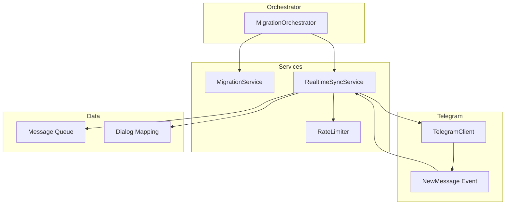
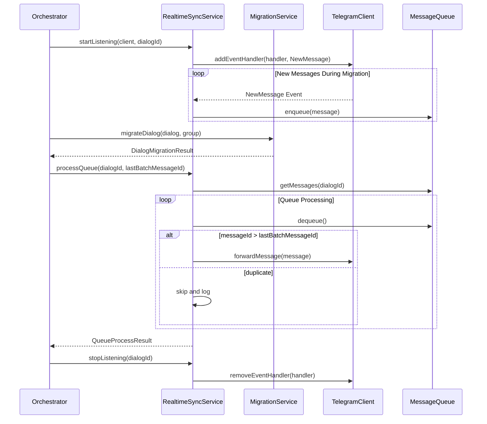
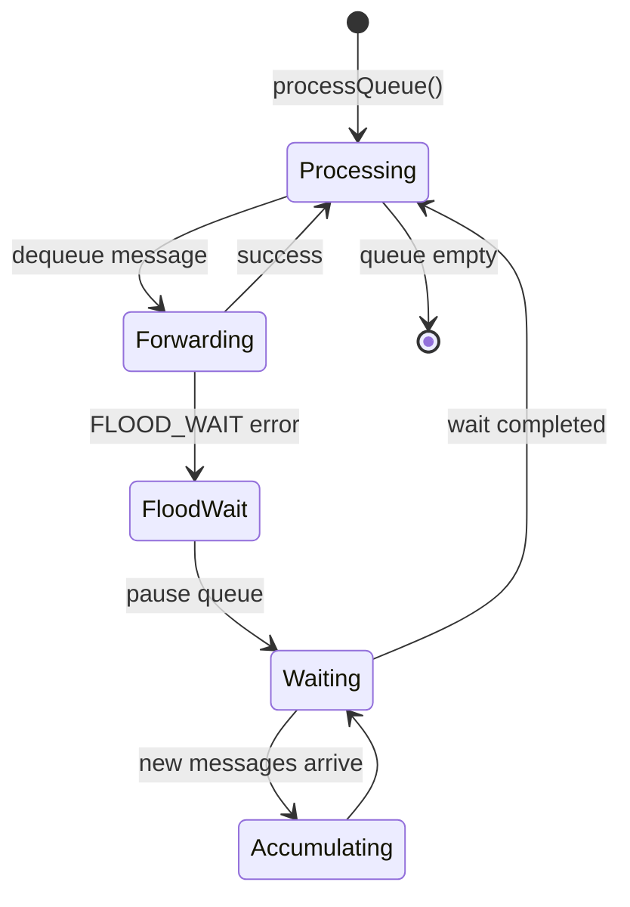
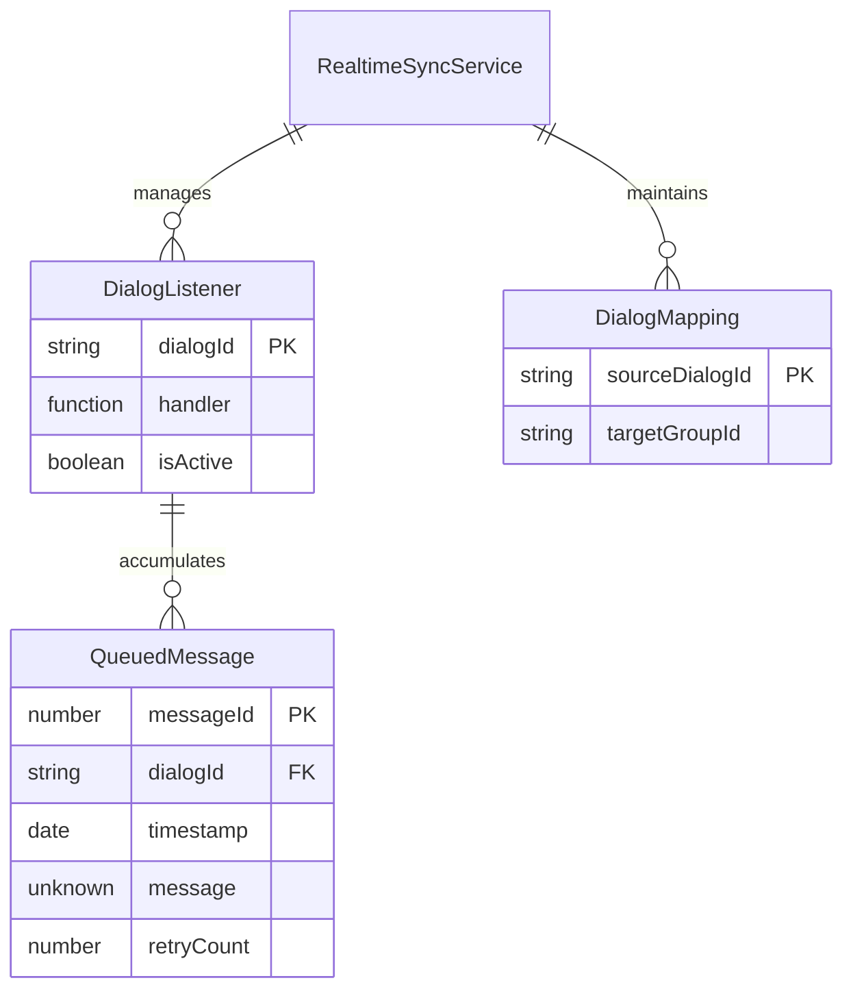

# Design Document: Realtime Message Sync

## Overview

**Purpose**: 本功能提供即時訊息同步機制，確保遷移期間來源對話的新訊息能被捕獲並在批次遷移完成後依序轉發至目標群組，避免遺漏任何訊息。

**Users**: 遷移工具使用者將透過此功能自動處理遷移期間產生的新訊息，無需額外操作。

**Impact**: 擴展現有 `MigrationOrchestrator` 流程，新增 `RealtimeSyncService` 服務模組，在對話遷移開始時啟動監聽、批次完成後處理佇列。

### Goals
- 監聽來源對話的新訊息事件，不遺漏遷移期間的任何訊息
- 使用佇列延遲轉發策略，確保目標群組訊息時間順序正確
- 與現有遷移流程無縫整合，不影響批次遷移效能
- 遵守 Telegram API 速率限制，避免觸發 FloodWait

### Non-Goals
- 即時雙向同步（僅支援來源→目標單向）
- 處理已刪除或已編輯的訊息
- 跨對話訊息合併或重新排序
- 支援媒體群組（album）的原子轉發

## Architecture

### Existing Architecture Analysis
現有系統採用服務導向架構，由 `MigrationOrchestrator` 協調各服務模組：
- **已有模式**: 服務透過 `OrchestratorServices` 介面注入，所有服務實作對應 `I*Service` 介面
- **整合點**: `runMigration` 方法中的對話遷移迴圈，`migrateDialog` 呼叫前後
- **保持不變**: `RateLimiter`、`ProgressService`、`MigrationService` 的現有介面

### Architecture Pattern & Boundary Map



**Architecture Integration**:
- **Selected pattern**: Observer Pattern - `RealtimeSyncService` 監聽 Telegram 事件，`Orchestrator` 控制生命週期
- **Domain boundaries**: 即時同步邏輯獨立於批次遷移邏輯，透過佇列解耦
- **Existing patterns preserved**: 服務介面定義、Result 錯誤處理、依賴注入
- **New components rationale**: `RealtimeSyncService` 封裝事件監聽與佇列管理，符合單一職責
- **Steering compliance**: 遵循服務導向架構與介面優先原則

### Technology Stack

| Layer | Choice / Version | Role in Feature | Notes |
|-------|------------------|-----------------|-------|
| Backend / Services | TypeScript 5.7+ | RealtimeSyncService 實作 | 嚴格模式 |
| Messaging / Events | GramJS (telegram) | NewMessage 事件監聽 | 現有依賴 |
| Data / Storage | In-memory Map | 佇列與映射表 | 無持久化需求 |

## System Flows

### Main Flow: Dialog Migration with Realtime Sync



**Key Decisions**:
- 監聽在批次遷移開始前啟動，確保不遺漏訊息
- 使用 `lastBatchMessageId` 作為去重分界點
- 佇列處理按訊息 ID 升序執行

### FloodWait Handling Flow



**Key Decisions**:
- FloodWait 期間暫停佇列處理但繼續接收新訊息
- 等待完成後從暫停點繼續處理

## Requirements Traceability

| Requirement | Summary | Components | Interfaces | Flows |
|-------------|---------|------------|------------|-------|
| 1.1 | 啟動對話監聽 | RealtimeSyncService | startListening | Main Flow |
| 1.2 | 檢查訊息來源 | RealtimeSyncService | handleNewMessage | Main Flow |
| 1.3 | 持續監聽並加入佇列 | RealtimeSyncService, MessageQueue | enqueue | Main Flow |
| 1.4 | 停止監聽並釋放資源 | RealtimeSyncService | stopListening | Main Flow |
| 1.5 | 監聽初始化錯誤處理 | RealtimeSyncService | startListening | Error Handling |
| 2.1 | 訊息加入佇列 | MessageQueue | enqueue | Main Flow |
| 2.2 | 遷移期間累積訊息 | MessageQueue | - | Main Flow |
| 2.3 | 批次完成後處理佇列 | RealtimeSyncService | processQueue | Main Flow |
| 2.4 | 更新統計並移除訊息 | RealtimeSyncService | processQueue | Main Flow |
| 2.5 | O(1) 映射表查詢 | DialogMapping | registerMapping | Main Flow |
| 2.6 | 新訊息加入佇列尾端 | MessageQueue | enqueue | Main Flow |
| 3.1 | Orchestrator 呼叫 startListening | MigrationOrchestrator | startListening | Main Flow |
| 3.2 | 更新映射表 | MigrationOrchestrator | registerMapping | Main Flow |
| 3.3 | 通知處理佇列 | MigrationOrchestrator | processQueue | Main Flow |
| 3.4 | 取消註冊並清理 | MigrationOrchestrator | stopListening | Main Flow |
| 3.5 | DryRun 模式跳過 | MigrationOrchestrator | - | - |
| 3.6 | 進度報告包含佇列狀態 | MigrationOrchestrator | getQueueStatus | - |
| 4.1 | 失敗訊息加入重試佇列 | RealtimeSyncService | processQueue | Error Handling |
| 4.2 | 最大重試次數 | RealtimeSyncService | processQueue | Error Handling |
| 4.3 | 不中斷批次遷移 | RealtimeSyncService | - | Error Handling |
| 4.4 | 輸出統計資訊 | RealtimeSyncService | getStats | - |
| 4.5 | Result 類型錯誤處理 | RealtimeSyncService | All | All |
| 5.1 | FloodWait 暫停處理 | RealtimeSyncService, RateLimiter | processQueue | FloodWait Flow |
| 5.2 | FloodWait 期間繼續接收 | RealtimeSyncService | handleNewMessage | FloodWait Flow |
| 5.3 | FloodWait 後繼續處理 | RealtimeSyncService | processQueue | FloodWait Flow |
| 5.4 | 整合 RateLimiter | RealtimeSyncService | - | FloodWait Flow |
| 5.5 | 佇列上限與丟棄 | MessageQueue | enqueue | Error Handling |
| 6.1 | 記錄訊息 ID 與時間戳 | QueuedMessage | - | - |
| 6.2 | 取得 lastBatchMessageId | RealtimeSyncService | processQueue | Main Flow |
| 6.3 | 按 ID 升序轉發 | RealtimeSyncService | processQueue | Main Flow |
| 6.4 | 跳過重複訊息 | RealtimeSyncService | processQueue | Main Flow |
| 6.5 | 追蹤最後處理 ID | RealtimeSyncService | - | Main Flow |
| 6.6 | 驗證訊息順序 | RealtimeSyncService | processQueue | Main Flow |
| 7.1 | 實作 IRealtimeSyncService | RealtimeSyncService | Interface | - |
| 7.2 | startListening 方法 | RealtimeSyncService | startListening | - |
| 7.3 | stopListening 方法 | RealtimeSyncService | stopListening | - |
| 7.4 | registerMapping 方法 | RealtimeSyncService | registerMapping | - |
| 7.5 | processQueue 方法 | RealtimeSyncService | processQueue | - |
| 7.6 | getQueueStatus 方法 | RealtimeSyncService | getQueueStatus | - |
| 7.7 | getStats 方法 | RealtimeSyncService | getStats | - |
| 7.8 | 依賴注入支援 | RealtimeSyncService | Constructor | - |

## Components and Interfaces

### Component Summary

| Component | Domain/Layer | Intent | Req Coverage | Key Dependencies | Contracts |
|-----------|--------------|--------|--------------|------------------|-----------|
| RealtimeSyncService | Services | 監聽新訊息並管理佇列轉發 | 1.x, 2.x, 4.x, 5.x, 6.x, 7.x | TelegramClient (P0), RateLimiter (P1), MigrationService (P1) | Service |
| MigrationOrchestrator | Services | 整合即時同步至遷移流程 | 3.x | RealtimeSyncService (P1) | Service |

### Services Layer

#### RealtimeSyncService

| Field | Detail |
|-------|--------|
| Intent | 監聽來源對話新訊息事件，管理對話專屬佇列，批次完成後依序轉發 |
| Requirements | 1.1-1.5, 2.1-2.6, 4.1-4.5, 5.1-5.5, 6.1-6.6, 7.1-7.8 |

**Responsibilities & Constraints**
- 管理 TelegramClient 事件監聽器的生命週期
- 維護對話專屬的訊息佇列，支援 O(1) 查詢
- 執行佇列處理並處理 FloodWait 中斷
- 佇列上限為 1000 則訊息，超過時丟棄最舊訊息

**Dependencies**
- Inbound: MigrationOrchestrator - 控制監聽生命週期 (P0)
- Outbound: TelegramClient - 事件監聽與訊息轉發 (P0)
- Outbound: RateLimiter - FloodWait 處理與速率控制 (P1)
- Outbound: MigrationService - forwardMessages API 呼叫 (P1)

**Contracts**: Service [x]

##### Service Interface

```typescript
/**
 * 佇列中的訊息資訊
 */
interface QueuedMessage {
  /** 原始訊息 ID */
  messageId: number;
  /** 原始時間戳 */
  timestamp: Date;
  /** GramJS Message 物件 */
  message: unknown;
  /** 重試次數 */
  retryCount: number;
}

/**
 * 佇列狀態
 */
interface QueueStatus {
  /** 待處理訊息數 */
  pending: number;
  /** 已處理訊息數 */
  processed: number;
  /** 失敗訊息數 */
  failed: number;
}

/**
 * 佇列處理結果
 */
interface QueueProcessResult {
  /** 成功轉發數 */
  successCount: number;
  /** 失敗數 */
  failedCount: number;
  /** 跳過數（重複訊息） */
  skippedCount: number;
  /** 失敗的訊息 ID 列表 */
  failedMessageIds: number[];
}

/**
 * 即時同步統計
 */
interface RealtimeSyncStats {
  /** 監聽中的對話數 */
  activeListeners: number;
  /** 總接收訊息數 */
  totalReceived: number;
  /** 總同步訊息數 */
  totalSynced: number;
  /** 總失敗數 */
  totalFailed: number;
  /** 總跳過數 */
  totalSkipped: number;
}

/**
 * 即時同步錯誤類型
 */
type RealtimeSyncError =
  | { type: 'LISTENER_INIT_FAILED'; dialogId: string; message: string }
  | { type: 'FORWARD_FAILED'; dialogId: string; messageId: number; message: string }
  | { type: 'QUEUE_OVERFLOW'; dialogId: string; droppedCount: number }
  | { type: 'FLOOD_WAIT'; seconds: number };

/**
 * 即時同步服務介面
 */
interface IRealtimeSyncService {
  /**
   * 開始監聽對話的新訊息
   * @param client - TelegramClient 實例
   * @param dialogId - 來源對話 ID
   * @returns 成功或錯誤
   */
  startListening(
    client: TelegramClient,
    dialogId: string
  ): Result<void, RealtimeSyncError>;

  /**
   * 停止監聽對話並清理資源
   * @param dialogId - 對話 ID
   */
  stopListening(dialogId: string): void;

  /**
   * 註冊來源對話與目標群組的映射
   * @param sourceDialogId - 來源對話 ID
   * @param targetGroupId - 目標群組 ID
   */
  registerMapping(sourceDialogId: string, targetGroupId: string): void;

  /**
   * 處理對話的待轉發佇列
   * @param dialogId - 對話 ID
   * @param lastBatchMessageId - 批次遷移最後處理的訊息 ID
   * @returns 處理結果或錯誤
   */
  processQueue(
    dialogId: string,
    lastBatchMessageId: number
  ): Promise<Result<QueueProcessResult, RealtimeSyncError>>;

  /**
   * 取得對話的佇列狀態
   * @param dialogId - 對話 ID
   * @returns 佇列狀態
   */
  getQueueStatus(dialogId: string): QueueStatus;

  /**
   * 取得整體同步統計
   * @returns 統計資訊
   */
  getStats(): RealtimeSyncStats;
}
```

- **Preconditions**:
  - `startListening`: client 已驗證且連線中
  - `processQueue`: 已呼叫 `registerMapping` 註冊映射
- **Postconditions**:
  - `startListening`: 事件監聽器已註冊
  - `stopListening`: 監聽器已移除、佇列已清空
  - `processQueue`: 佇列中符合條件的訊息已處理
- **Invariants**:
  - 每個對話最多一個活躍監聽器
  - 佇列訊息按 ID 升序處理

**Implementation Notes**
- **Integration**: 使用 GramJS `client.addEventHandler(handler, new NewMessage({ chats: [dialogId] }))` 註冊監聽
- **Validation**: `processQueue` 檢查 `messageId > lastBatchMessageId` 過濾重複
- **Risks**: 事件監聽器可能因網路中斷而停止，需監控連線狀態

#### MigrationOrchestrator (Extension)

| Field | Detail |
|-------|--------|
| Intent | 整合 RealtimeSyncService 至遷移流程 |
| Requirements | 3.1-3.6 |

**Responsibilities & Constraints**
- 在對話遷移開始前呼叫 `startListening`
- 群組建立後呼叫 `registerMapping`
- 批次遷移完成後呼叫 `processQueue`
- DryRun 模式跳過所有即時同步操作

**Dependencies**
- Inbound: CLI Layer - 執行遷移指令 (P0)
- Outbound: RealtimeSyncService - 即時同步控制 (P1)

**Contracts**: Service [x]

##### Service Interface (Extension)

```typescript
/**
 * 擴展的 OrchestratorServices 介面
 */
interface OrchestratorServices {
  // ... existing services
  realtimeSyncService?: IRealtimeSyncService;
}

/**
 * 擴展的 OrchestratorResult 介面
 */
interface OrchestratorResult {
  // ... existing fields
  /** 即時同步統計 */
  realtimeSyncStats?: {
    totalReceived: number;
    totalSynced: number;
    totalFailed: number;
    totalSkipped: number;
  };
}
```

**Implementation Notes**
- **Integration**: 在 `runMigration` 的對話迴圈中整合即時同步呼叫
- **Validation**: 檢查 `dryRun` 選項決定是否啟用即時同步
- **Risks**: 需確保 `stopListening` 在所有情況下都被呼叫（包含錯誤路徑）

## Data Models

### Domain Model



**Aggregates**:
- `RealtimeSyncService` 為聚合根，管理所有監聽器與佇列

**Business Rules**:
- 每個對話最多一個活躍監聽器
- 佇列訊息必須包含 `messageId` 與 `timestamp`
- `messageId <= lastBatchMessageId` 的訊息視為重複

### Logical Data Model

**DialogListener**
- `dialogId: string` - 對話 ID（主鍵）
- `handler: Function` - 事件處理函式（用於移除監聽）
- `isActive: boolean` - 是否活躍

**DialogMapping**
- `sourceDialogId: string` - 來源對話 ID（主鍵）
- `targetGroupId: string` - 目標群組 ID

**QueuedMessage**
- `messageId: number` - 訊息 ID（主鍵）
- `dialogId: string` - 所屬對話 ID（外鍵）
- `timestamp: Date` - 原始時間戳
- `message: unknown` - GramJS Message 物件
- `retryCount: number` - 重試次數（預設 0）

**Indexing**:
- `Map<dialogId, DialogListener>` - O(1) 監聽器查詢
- `Map<sourceDialogId, targetGroupId>` - O(1) 映射查詢
- `Map<dialogId, QueuedMessage[]>` - O(1) 佇列查詢

### Data Contracts & Integration

**QueuedMessage Schema**
```typescript
interface QueuedMessage {
  messageId: number;      // Telegram 訊息 ID
  timestamp: Date;        // 訊息發送時間
  message: unknown;       // GramJS Api.Message 物件
  retryCount: number;     // 重試次數，預設 0
}
```

**Validation Rules**:
- `messageId` 必須為正整數
- `timestamp` 必須為有效 Date
- `retryCount` 必須 >= 0

## Error Handling

### Error Strategy
本功能採用「不中斷原則」，即時同步的錯誤不會中斷批次遷移流程。

### Error Categories and Responses

**Listener Errors** (LISTENER_INIT_FAILED):
- 記錄錯誤日誌
- 回傳 `Result<void, RealtimeSyncError>`
- 不影響批次遷移繼續執行

**Forward Errors** (FORWARD_FAILED):
- 將訊息加入重試佇列
- 重試達上限（3 次）後記錄為失敗
- 繼續處理其他訊息

**Queue Overflow** (QUEUE_OVERFLOW):
- 丟棄最舊訊息
- 記錄警告日誌
- 繼續接收新訊息

**Rate Limit Errors** (FLOOD_WAIT):
- 暫停佇列處理
- 等待指定秒數
- 繼續接收新訊息
- 等待結束後繼續處理

### Monitoring
- 記錄每次佇列處理的統計（成功/失敗/跳過）
- 記錄 FloodWait 事件至 `ReportService`
- 在最終報告中包含即時同步統計

## Testing Strategy

### Unit Tests
- `RealtimeSyncService.startListening`: 驗證監聽器註冊
- `RealtimeSyncService.enqueue`: 驗證訊息加入佇列與排序
- `RealtimeSyncService.processQueue`: 驗證去重邏輯與順序處理
- `RealtimeSyncService.getQueueStatus`: 驗證狀態計算
- 佇列上限與丟棄邏輯

### Integration Tests
- Orchestrator 與 RealtimeSyncService 整合流程
- 批次遷移完成後佇列處理流程
- DryRun 模式跳過即時同步
- 錯誤路徑下的資源清理

### E2E Tests
- 完整遷移流程中的即時訊息同步
- FloodWait 中斷與恢復
- 多對話同時遷移的隔離性

## Performance & Scalability

**Target Metrics**:
- 佇列操作 O(1) 時間複雜度
- 單對話佇列上限 1000 則訊息
- 訊息處理延遲 < 批次遷移時間 + 佇列處理時間

**Memory Constraints**:
- 每則 QueuedMessage 約 1KB
- 單對話最大記憶體使用約 1MB
- 多對話同時遷移需監控總記憶體使用

## Supporting References

### GramJS Event Handler Usage

```typescript
import { NewMessage } from 'telegram/events';
import type { NewMessageEvent } from 'telegram/events';

// 註冊監聽器
const handler = async (event: NewMessageEvent) => {
  const message = event.message;
  // 處理訊息
};

client.addEventHandler(handler, new NewMessage({ chats: [dialogId] }));

// 移除監聽器
client.removeEventHandler(handler, new NewMessage({}));
```

### Error Type Definition

```typescript
// 新增至 src/types/errors.ts
export type RealtimeSyncError =
  | { type: 'LISTENER_INIT_FAILED'; dialogId: string; message: string }
  | { type: 'FORWARD_FAILED'; dialogId: string; messageId: number; message: string }
  | { type: 'QUEUE_OVERFLOW'; dialogId: string; droppedCount: number }
  | { type: 'FLOOD_WAIT'; seconds: number };
```

### Interface Extension

```typescript
// 新增至 src/types/interfaces.ts
export interface IRealtimeSyncService {
  startListening(client: TelegramClient, dialogId: string): Result<void, RealtimeSyncError>;
  stopListening(dialogId: string): void;
  registerMapping(sourceDialogId: string, targetGroupId: string): void;
  processQueue(dialogId: string, lastBatchMessageId: number): Promise<Result<QueueProcessResult, RealtimeSyncError>>;
  getQueueStatus(dialogId: string): QueueStatus;
  getStats(): RealtimeSyncStats;
}
```
