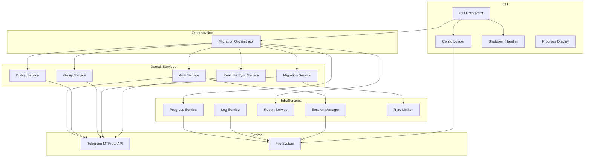
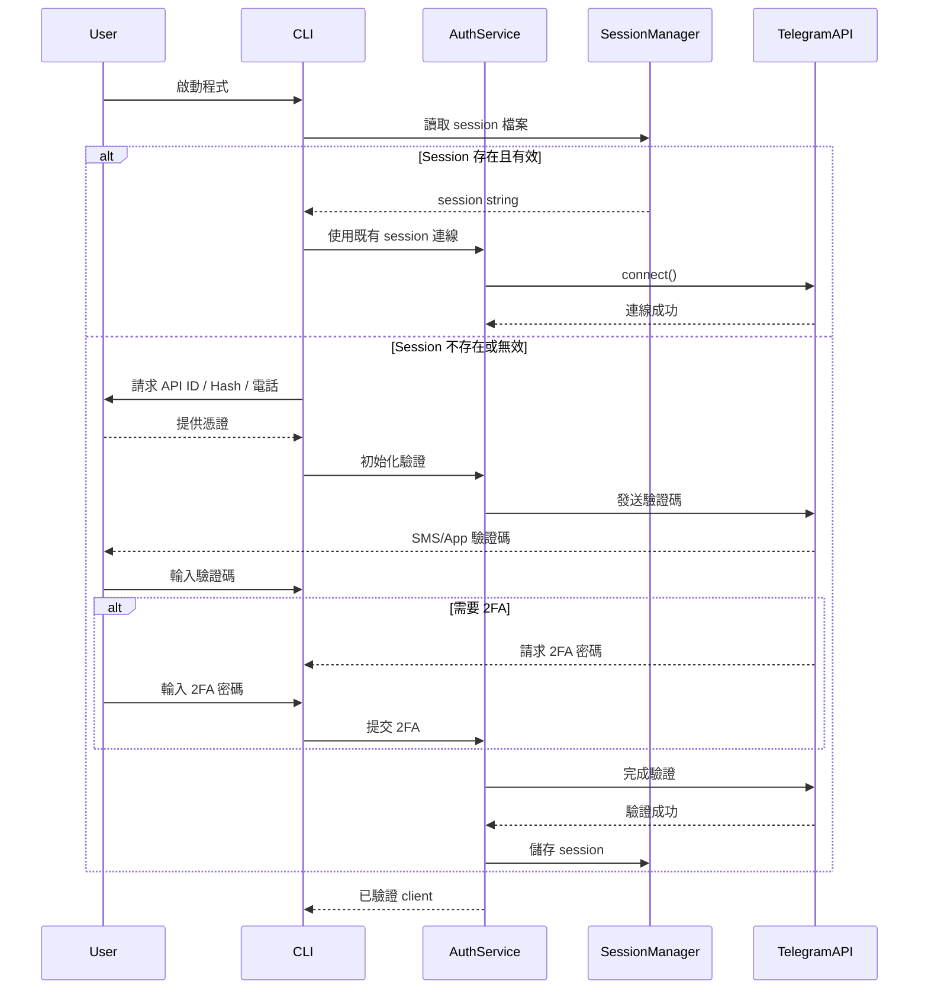
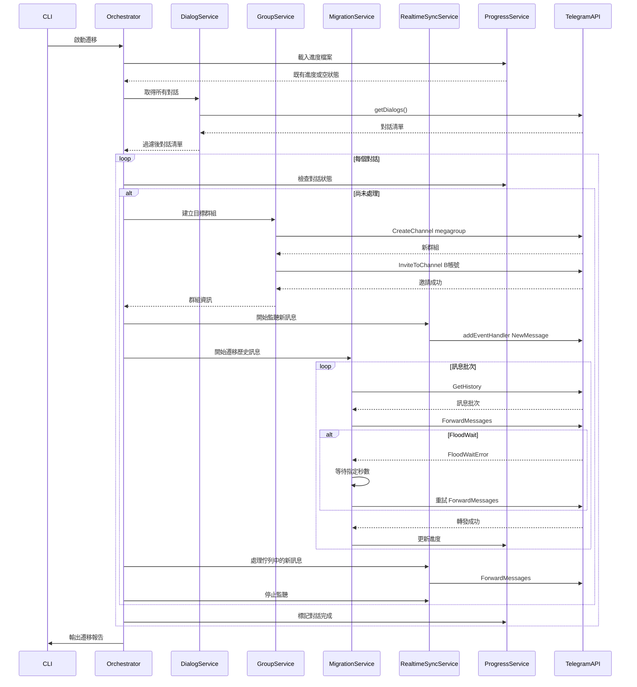
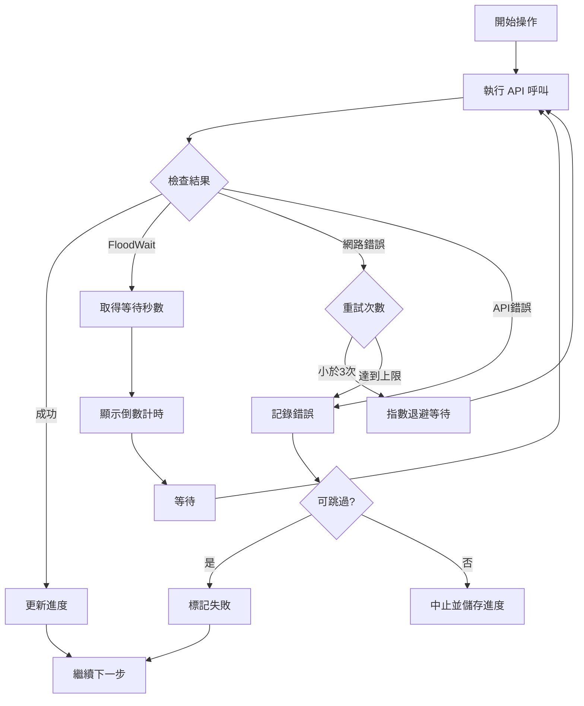
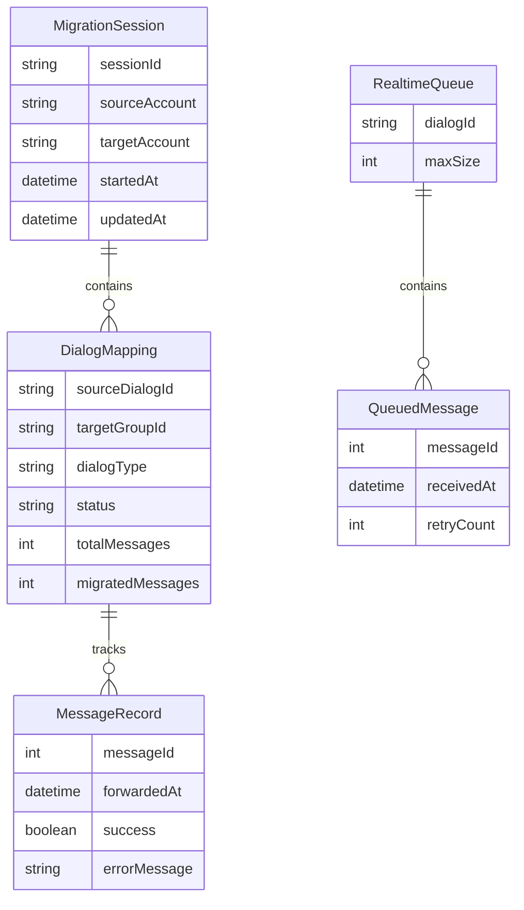
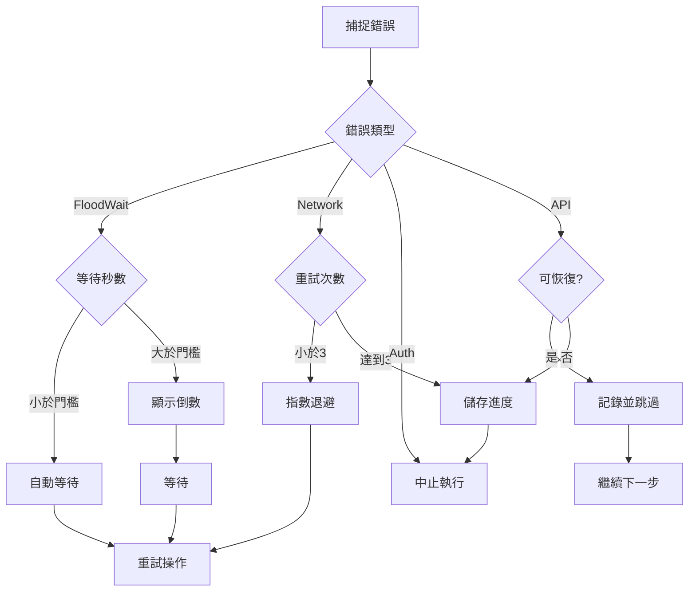

# Design Document: Telegram Message Migration

## Overview

**Purpose**: 本功能提供 Telegram 帳號間的完整訊息遷移能力，讓使用者能將 A 帳號的所有對話內容（包含私人聊天、群組、頻道、機器人對話）遷移至 B 帳號可存取的新群組中，並打包成 Mac 原生可執行檔供無需安裝依賴即可使用。

**Users**: 需要帳號遷移或備份的 Telegram 使用者，透過命令列介面執行批次遷移作業。

**Impact**: 建立全新的遷移工具，使用 GramJS 函式庫實作 Telegram MTProto API 操作，以 Node.js SEA 或 pkg 打包為 Mac 原生執行檔。

### Goals
- 完整遷移 A 帳號所有對話類型的訊息至對應的新群組
- 自動處理 Telegram API 流量限制，確保穩定執行
- 支援斷點續傳，大量訊息遷移過程不因中斷而遺失進度
- 遷移期間即時同步新訊息，確保不遺漏
- 提供清晰的執行狀態與遷移報告
- 打包為 Mac 原生可執行檔，支援 Intel (x64) 與 Apple Silicon (arm64)

### Non-Goals
- 不支援訊息的雙向同步
- 不保留原始訊息的時間戳記（轉發訊息使用轉發時間）
- 不支援遷移至 B 帳號的既有群組
- 不實作圖形化使用者介面
- 不處理 Bot Token 驗證（僅支援 Userbot）

## Architecture

> 詳細研究筆記請參閱 `research.md`。

### Architecture Pattern & Boundary Map

**Selected Pattern**: 分層服務架構 (Layered Service Architecture)



**Architecture Integration**:
- Selected pattern: 分層服務架構 - 職責分離清晰、易於測試與維護
- Domain boundaries: 驗證、對話探索、群組管理、遷移執行、即時同步為獨立服務
- New components rationale: 每個服務對應一個核心需求領域，RealtimeSyncService 新增以滿足即時同步需求
- Steering compliance: 遵循 `structure.md` 定義的分層架構與命名慣例

### Technology Stack

| Layer | Choice / Version | Role in Feature | Notes |
|-------|------------------|-----------------|-------|
| Runtime | Node.js >= 18 LTS | 執行環境 | 支援 ES Modules、原生 fetch、SEA |
| Language | TypeScript 5.7+ | 強型別開發 | 嚴格模式啟用 |
| Telegram Client | telegram (GramJS) ^2.26 | MTProto API 操作 | npm package name |
| CLI Framework | commander ^12.x | 命令列解析 | 輕量、廣泛使用 |
| User Input | input ^1.x | 互動式輸入 | 驗證碼、密碼輸入 |
| Logging | winston ^3.x | 結構化日誌 | 多輸出目標支援 |
| Config | dotenv ^16.x | 環境變數管理 | 敏感資料隔離 |
| Bundler | esbuild / rollup | 程式碼打包 | SEA 前置處理 |
| Packaging | Node.js SEA | Mac 可執行檔 | 原生支援，替代已棄用的 pkg |
| Testing | Vitest ^2.x | 單元與整合測試 | 快速、ESM 原生支援 |

## System Flows

### Authentication Flow



### Migration Flow with Realtime Sync



### Error Recovery Flow



## Requirements Traceability

| Requirement | Summary | Components | Interfaces | Flows |
|-------------|---------|------------|------------|-------|
| 1.1, 1.2 | API 憑證輸入與驗證 | AuthService, ConfigLoader | IAuthService, IConfigLoader | Authentication Flow |
| 1.3, 1.4 | 帳號 A/B 登入 | AuthService, SessionManager | IAuthService | Authentication Flow |
| 1.5, 1.6 | 2FA 處理與錯誤訊息 | AuthService | IAuthService | Authentication Flow |
| 1.7, 1.8 | Session 儲存 | SessionManager | - | Authentication Flow |
| 2.1, 2.2 | 對話列舉與顯示 | DialogService | IDialogService | Migration Flow |
| 2.3, 2.4, 2.5 | 對話過濾 | DialogService, ConfigLoader | IDialogService | Migration Flow |
| 2.6, 2.7 | 多重過濾與進度 | DialogService | IDialogService | Migration Flow |
| 3.1, 3.2 | 群組建立與命名 | GroupService | IGroupService | Migration Flow |
| 3.3, 3.4 | B 帳號邀請與管理員 | GroupService | IGroupService | Migration Flow |
| 3.5, 3.6, 3.7 | 群組錯誤處理 | GroupService, ProgressService | IGroupService | Migration Flow |
| 4.1, 4.2, 4.3 | 訊息轉發與順序 | MigrationService | IMigrationService | Migration Flow |
| 4.4, 4.5, 4.6, 4.7 | 批次控制與錯誤 | MigrationService, RateLimiter | IMigrationService | Migration Flow |
| 5.1, 5.2, 5.3 | 進度持久化 | ProgressService | IProgressService | Migration Flow |
| 5.4, 5.5, 5.6 | 斷點續傳 | ProgressService, Orchestrator | IProgressService | Migration Flow |
| 6.1, 6.2, 6.3 | FloodWait 處理 | RateLimiter, MigrationService | IRateLimiter | Error Recovery Flow |
| 6.4, 6.5, 6.6 | 速率調整 | RateLimiter | IRateLimiter | Error Recovery Flow |
| 7.1, 7.2, 7.3 | 即時訊息監聽 | RealtimeSyncService | IRealtimeSyncService | Migration Flow |
| 7.4, 7.5 | 新訊息佇列處理 | RealtimeSyncService | IRealtimeSyncService | Migration Flow |
| 8.1, 8.2, 8.3 | 進度顯示 | ProgressDisplay, LogService | ILogService | All Flows |
| 8.4, 8.5, 8.6 | 日誌與報告 | LogService, ReportService | ILogService | All Flows |
| 9.1, 9.2, 9.3 | Mac 可執行檔 | Build Scripts | - | - |
| 9.4, 9.5, 9.6 | 平台支援 | Build Scripts | - | - |
| 10.1, 10.2 | 本機儲存與 MTProto | All Services | - | All Flows |
| 10.3, 10.4, 10.5 | 資料清除與安全 | SessionManager, ProgressService | - | - |

## Components and Interfaces

| Component | Domain/Layer | Intent | Req Coverage | Key Dependencies | Contracts |
|-----------|--------------|--------|--------------|------------------|-----------|
| AuthService | Domain | 管理 Telegram 帳號驗證與連線 | 1.1-1.8 | TelegramClient (P0), SessionManager (P0) | Service |
| DialogService | Domain | 列舉與過濾 A 帳號對話 | 2.1-2.7 | TelegramClient (P0), AuthService (P0) | Service |
| GroupService | Domain | 建立目標群組與邀請成員 | 3.1-3.7 | TelegramClient (P0), AuthService (P0) | Service |
| MigrationService | Domain | 執行訊息遷移核心邏輯 | 4.1-4.7 | All Services (P0) | Service |
| RealtimeSyncService | Domain | 即時監聽新訊息並同步 | 7.1-7.5 | TelegramClient (P0), MigrationService (P1) | Service |
| ProgressService | Infrastructure | 管理遷移進度持久化 | 5.1-5.6 | FileSystem (P0) | Service, State |
| LogService | Infrastructure | 結構化日誌與報告產生 | 8.1-8.6 | winston (P1) | Service |
| ReportService | Infrastructure | 遷移報告產生 | 8.3 | LogService (P1) | Service |
| ConfigLoader | Infrastructure | 載入與驗證設定 | 1.1, 2.3-2.5 | FileSystem (P0) | Service |
| SessionManager | Infrastructure | Session 持久化管理 | 1.7, 1.8 | FileSystem (P0) | Service |
| RateLimiter | Infrastructure | 流量控制與速率調整 | 6.1-6.6 | - | Service |
| CLI | Presentation | 命令列介面與使用者互動 | 8.1, 9.3 | commander (P1), input (P1) | - |

### Domain Layer

#### AuthService

| Field | Detail |
|-------|--------|
| Intent | 管理 Telegram 帳號的 Userbot 驗證流程 |
| Requirements | 1.1, 1.2, 1.3, 1.4, 1.5, 1.6 |

**Responsibilities & Constraints**
- 初始化 TelegramClient 並執行互動式驗證
- 處理 2FA 密碼驗證流程
- 實作連線重試機制（最多 3 次）

**Dependencies**
- External: TelegramClient (GramJS) - Telegram API 操作 (P0)
- External: input - 互動式輸入取得 (P1)
- Outbound: SessionManager - session 儲存與載入 (P0)

**Contracts**: Service [x]

##### Service Interface

```typescript
interface IAuthService {
  /**
   * 使用既有 session 或互動式驗證取得已驗證的 client
   */
  authenticate(config: AuthConfig): Promise<Result<TelegramClient, AuthError>>;

  /**
   * 中斷連線並清理資源
   */
  disconnect(client: TelegramClient): Promise<void>;
}

interface AuthConfig {
  apiId: number;
  apiHash: string;
  sessionPath: string;
  phoneNumber?: string;
  connectionRetries?: number;  // default: 5
  floodSleepThreshold?: number;  // default: 300
}

type AuthError =
  | { type: 'INVALID_CREDENTIALS'; message: string }
  | { type: 'INVALID_CODE'; message: string; attemptsLeft: number }
  | { type: 'INVALID_2FA'; message: string }
  | { type: 'NETWORK_ERROR'; message: string; retryCount: number }
  | { type: 'SESSION_EXPIRED'; message: string };
```

- Preconditions: API ID 與 API Hash 必須有效
- Postconditions: 回傳已驗證的 TelegramClient 實例
- Invariants: Session 儲存後可用於後續重新連線

**Implementation Notes**
- Integration: 使用 GramJS `client.start()` 搭配回呼函式
- Validation: 驗證 API ID 為正整數、API Hash 為 32 字元十六進位字串
- Risks: Session 檔案權限需設為 600 避免洩漏

---

#### DialogService

| Field | Detail |
|-------|--------|
| Intent | 列舉並過濾 A 帳號的所有對話 |
| Requirements | 2.1, 2.2, 2.3, 2.4, 2.5, 2.6, 2.7 |

**Responsibilities & Constraints**
- 使用 GramJS `getDialogs()` 取得所有對話
- 支援對話類型、ID、日期範圍過濾
- 記錄對話基本資訊（ID、類型、名稱、訊息數）

**Dependencies**
- Inbound: CLI - 觸發對話列舉 (P0)
- External: TelegramClient - getDialogs API (P0)

**Contracts**: Service [x]

##### Service Interface

```typescript
interface IDialogService {
  /**
   * 取得所有對話（自動處理分頁）
   */
  getAllDialogs(client: TelegramClient): Promise<Result<DialogInfo[], DialogError>>;

  /**
   * 根據過濾條件篩選對話
   */
  filterDialogs(dialogs: DialogInfo[], filter: DialogFilter): DialogInfo[];

  /**
   * 取得單一對話的詳細資訊
   */
  getDialogInfo(client: TelegramClient, dialogId: string): Promise<Result<DialogInfo, DialogError>>;
}

interface DialogInfo {
  id: string;
  accessHash: string;
  name: string;
  type: DialogType;
  messageCount: number;
  isArchived: boolean;
  entity: unknown;  // GramJS Entity for API calls
}

type DialogType = 'private' | 'group' | 'supergroup' | 'channel' | 'bot';

interface DialogFilter {
  includeIds?: string[];
  excludeIds?: string[];
  types?: DialogType[];
  dateRange?: DateRange;
}

type DialogError =
  | { type: 'FETCH_FAILED'; message: string }
  | { type: 'NOT_FOUND'; dialogId: string }
  | { type: 'ACCESS_DENIED'; dialogId: string };
```

**Implementation Notes**
- Integration: 使用 `client.getDialogs()` 高階方法，自動處理分頁
- Validation: 檢查 dialog.entity 類型判斷對話類型
- Risks: 大量對話時可能觸發 FloodWait

---

#### GroupService

| Field | Detail |
|-------|--------|
| Intent | 為來源對話建立對應的目標群組並邀請 B 帳號 |
| Requirements | 3.1, 3.2, 3.3, 3.4, 3.5, 3.6, 3.7 |

**Responsibilities & Constraints**
- 建立超級群組作為遷移目標
- 使用來源對話名稱加前綴命名
- 邀請 B 帳號加入群組並設為管理員
- 記錄來源與目標的對應關係

**Dependencies**
- Inbound: MigrationService - 請求建立群組 (P0)
- External: TelegramClient - CreateChannel, InviteToChannel API (P0)

**Contracts**: Service [x]

##### Service Interface

```typescript
interface IGroupService {
  /**
   * 為來源對話建立對應的目標群組
   */
  createTargetGroup(
    client: TelegramClient,
    sourceDialog: DialogInfo,
    config: GroupConfig
  ): Promise<Result<GroupInfo, GroupError>>;

  /**
   * 邀請使用者加入群組
   */
  inviteUser(
    client: TelegramClient,
    group: GroupInfo,
    userIdentifier: string  // username or phone
  ): Promise<Result<void, GroupError>>;

  /**
   * 將使用者設為群組管理員
   */
  promoteToAdmin(
    client: TelegramClient,
    group: GroupInfo,
    userIdentifier: string
  ): Promise<Result<void, GroupError>>;

  /**
   * 驗證使用者是否可被邀請
   */
  canInviteUser(
    client: TelegramClient,
    userIdentifier: string
  ): Promise<Result<boolean, GroupError>>;
}

interface GroupConfig {
  namePrefix: string;  // e.g., "[Migrated] "
}

interface GroupInfo {
  id: string;
  accessHash: string;
  name: string;
  sourceDialogId: string;
  createdAt: string;
  entity: unknown;  // GramJS Entity
}

type GroupError =
  | { type: 'CREATE_FAILED'; message: string }
  | { type: 'DAILY_LIMIT_REACHED'; retryAfter: number }
  | { type: 'USER_RESTRICTED'; message: string }
  | { type: 'INVITE_FAILED'; userIdentifier: string; message: string }
  | { type: 'USER_NOT_FOUND'; userIdentifier: string }
  | { type: 'FLOOD_WAIT'; seconds: number };
```

**Implementation Notes**
- Integration: 使用 `channels.CreateChannel({ megagroup: true })` 建立超級群組
- Validation: 建立前驗證 B 帳號存在且可被邀請
- Risks: 頻繁建立群組可能觸發 FloodWait 或達到每日上限

---

#### MigrationService

| Field | Detail |
|-------|--------|
| Intent | 執行訊息遷移的核心邏輯，包含批次轉發與流量控制 |
| Requirements | 4.1, 4.2, 4.3, 4.4, 4.5, 4.6, 4.7 |

**Responsibilities & Constraints**
- 協調對話遷移的完整流程
- 批次取得歷史訊息並轉發
- 處理 FloodWaitError 並實作自適應速率
- 更新遷移進度

**Dependencies**
- Inbound: Orchestrator - 啟動遷移流程 (P0)
- Outbound: DialogService - 取得對話資訊 (P0)
- Outbound: GroupService - 建立目標群組 (P0)
- Outbound: ProgressService - 更新進度 (P0)
- Outbound: RateLimiter - 速率控制 (P0)
- Outbound: LogService - 記錄日誌 (P1)
- External: TelegramClient - GetHistory, ForwardMessages API (P0)

**Contracts**: Service [x]

##### Service Interface

```typescript
interface IMigrationService {
  /**
   * 遷移單一對話
   */
  migrateDialog(
    client: TelegramClient,
    sourceDialog: DialogInfo,
    targetGroup: GroupInfo,
    config: MigrationConfig,
    onProgress?: ProgressCallback
  ): Promise<Result<DialogMigrationResult, MigrationError>>;

  /**
   * 取得對話的歷史訊息（分頁）
   */
  getMessages(
    client: TelegramClient,
    dialog: DialogInfo,
    options: GetMessagesOptions
  ): Promise<Result<MessageBatch, MigrationError>>;

  /**
   * 批次轉發訊息
   */
  forwardMessages(
    client: TelegramClient,
    fromPeer: unknown,
    toPeer: unknown,
    messageIds: number[]
  ): Promise<Result<ForwardResult, MigrationError>>;
}

interface MigrationConfig {
  batchSize: number;  // default: 100
  groupConfig: GroupConfig;
  targetAccountB: string;
  progressPath: string;
  dialogFilter?: DialogFilter;
  dateRange?: DateRange;
}

interface MigrationOptions {
  dryRun?: boolean;  // 預覽模式，不實際執行
  resumeFrom?: string;  // 從特定對話繼續
}

interface GetMessagesOptions {
  offsetId?: number;
  limit?: number;
  minDate?: Date;
  maxDate?: Date;
}

interface MessageBatch {
  messages: MessageInfo[];
  hasMore: boolean;
  nextOffsetId: number | null;
}

interface MessageInfo {
  id: number;
  date: Date;
  hasMedia: boolean;
}

type ProgressCallback = (event: ProgressEvent) => void;

type ProgressEvent =
  | { type: 'dialog_started'; dialogId: string; totalMessages: number }
  | { type: 'batch_completed'; dialogId: string; count: number; total: number }
  | { type: 'dialog_completed'; dialogId: string; result: DialogMigrationResult }
  | { type: 'flood_wait'; seconds: number; operation: string };

interface DialogMigrationResult {
  dialogId: string;
  success: boolean;
  migratedMessages: number;
  failedMessages: number;
  errors: string[];
}

interface ForwardResult {
  successCount: number;
  failedIds: number[];
}

type MigrationError =
  | { type: 'DIALOG_FETCH_FAILED'; message: string }
  | { type: 'GROUP_CREATE_FAILED'; dialogId: string; message: string }
  | { type: 'INVITE_FAILED'; dialogId: string; message: string }
  | { type: 'FORWARD_FAILED'; dialogId: string; messageIds: number[]; message: string }
  | { type: 'FLOOD_WAIT'; seconds: number }
  | { type: 'ABORTED'; reason: string };
```

**Implementation Notes**
- Integration: 使用 `messages.GetHistory` 分頁取得訊息，`messages.ForwardMessages` 批次轉發
- Validation: 每批次轉發前驗證訊息 ID 有效
- Risks: 長時間執行需確保連線穩定，處理中斷訊號

---

#### RealtimeSyncService

| Field | Detail |
|-------|--------|
| Intent | 遷移期間監聽來源對話的新訊息並同步至目標群組 |
| Requirements | 7.1, 7.2, 7.3, 7.4, 7.5 |

**Responsibilities & Constraints**
- 監聽指定對話的 NewMessage 事件
- 將新訊息加入對話專屬佇列
- 歷史訊息遷移完成後處理佇列
- 去重邏輯確保不重複轉發已遷移訊息

**Dependencies**
- Inbound: Orchestrator - 控制監聽生命週期 (P0)
- External: TelegramClient - addEventHandler API (P0)
- Outbound: MigrationService - 轉發訊息 (P1)

**Contracts**: Service [x]

##### Service Interface

```typescript
interface IRealtimeSyncService {
  /**
   * 開始監聽對話的新訊息
   */
  startListening(
    client: TelegramClient,
    dialogId: string
  ): Result<void, RealtimeSyncError>;

  /**
   * 停止監聽對話並清理資源
   */
  stopListening(dialogId: string): void;

  /**
   * 註冊來源對話與目標群組的映射
   */
  registerMapping(sourceDialogId: string, targetGroupId: string): void;

  /**
   * 處理對話的待轉發佇列
   */
  processQueue(
    dialogId: string,
    lastBatchMessageId: number
  ): Promise<Result<QueueProcessResult, RealtimeSyncError>>;

  /**
   * 取得對話的佇列狀態
   */
  getQueueStatus(dialogId: string): QueueStatus;

  /**
   * 取得整體同步統計
   */
  getStats(): RealtimeSyncStats;
}

interface QueuedMessage {
  messageId: number;
  timestamp: Date;
  message: unknown;  // GramJS Message
  retryCount: number;
}

interface QueueStatus {
  pending: number;
  processed: number;
  failed: number;
}

interface QueueProcessResult {
  successCount: number;
  failedCount: number;
  skippedCount: number;
  failedMessageIds: number[];
}

interface RealtimeSyncStats {
  activeListeners: number;
  totalReceived: number;
  totalSynced: number;
  totalFailed: number;
  totalSkipped: number;
}

type RealtimeSyncError =
  | { type: 'LISTENER_INIT_FAILED'; dialogId: string; message: string }
  | { type: 'FORWARD_FAILED'; dialogId: string; messageId: number; message: string }
  | { type: 'QUEUE_OVERFLOW'; dialogId: string; dropped: number };
```

- Preconditions: 對話遷移已開始，目標群組已建立
- Postconditions: 新訊息依序加入佇列或轉發至目標
- Invariants: 佇列大小不超過 maxQueueSize（預設 1000）

**Implementation Notes**
- Integration: 使用 GramJS `client.addEventHandler()` 搭配 `NewMessage` 事件過濾
- Validation: 訊息 ID 比對確保不重複轉發
- Risks: 高流量對話可能導致佇列溢出

---

### Infrastructure Layer

#### ProgressService

| Field | Detail |
|-------|--------|
| Intent | 管理遷移進度的持久化與讀取，支援斷點續傳 |
| Requirements | 5.1, 5.2, 5.3, 5.4, 5.5, 5.6 |

**Responsibilities & Constraints**
- 維護 JSON 格式的進度檔案
- 為每個對話獨立追蹤遷移狀態
- 支援進度匯出與匯入
- 實作原子寫入避免檔案損毀

**Dependencies**
- External: FileSystem - 進度檔案讀寫 (P0)

**Contracts**: Service [x] / State [x]

##### Service Interface

```typescript
interface IProgressService {
  /**
   * 載入進度檔案，不存在則回傳空狀態
   */
  load(path: string): Promise<Result<MigrationProgress, ProgressError>>;

  /**
   * 儲存進度至檔案（原子寫入）
   */
  save(path: string, progress: MigrationProgress): Promise<Result<void, ProgressError>>;

  /**
   * 更新特定對話的遷移進度
   */
  updateDialogProgress(
    progress: MigrationProgress,
    dialogId: string,
    lastMessageId: number,
    messageCount: number
  ): MigrationProgress;

  /**
   * 標記對話遷移完成
   */
  markDialogComplete(progress: MigrationProgress, dialogId: string): MigrationProgress;

  /**
   * 取得對話的遷移狀態
   */
  getDialogStatus(progress: MigrationProgress, dialogId: string): DialogStatus;

  /**
   * 匯出進度為可分享格式
   */
  exportProgress(progress: MigrationProgress): string;

  /**
   * 從匯出格式匯入進度
   */
  importProgress(data: string): Result<MigrationProgress, ProgressError>;
}

type ProgressError =
  | { type: 'FILE_NOT_FOUND'; path: string }
  | { type: 'FILE_CORRUPTED'; path: string; message: string }
  | { type: 'WRITE_FAILED'; path: string; message: string }
  | { type: 'INVALID_FORMAT'; message: string };
```

##### State Management

```typescript
interface MigrationProgress {
  version: string;  // "1.0"
  startedAt: string;  // ISO 8601
  updatedAt: string;  // ISO 8601
  sourceAccount: string;  // phone number (masked)
  targetAccount: string;  // username or phone
  dialogs: Record<string, DialogProgress>;
  statistics: MigrationStatistics;
}

interface DialogProgress {
  dialogId: string;
  dialogName: string;
  dialogType: DialogType;
  targetGroupId: string | null;
  status: DialogStatus;
  totalMessages: number;
  migratedMessages: number;
  lastProcessedMessageId: number | null;
  startedAt: string | null;
  completedAt: string | null;
  errors: DialogError[];
}

type DialogStatus = 'pending' | 'in_progress' | 'completed' | 'failed' | 'skipped';

interface DialogError {
  timestamp: string;
  messageId: number | null;
  errorType: string;
  errorMessage: string;
}

interface MigrationStatistics {
  totalDialogs: number;
  completedDialogs: number;
  failedDialogs: number;
  skippedDialogs: number;
  totalMessages: number;
  migratedMessages: number;
  failedMessages: number;
  floodWaitEvents: number;
  totalFloodWaitSeconds: number;
}
```

- Persistence: JSON 檔案，每次更新寫入
- Consistency: 原子寫入（先寫暫存檔再 rename）
- Concurrency: 單執行緒存取，無並發問題

**Implementation Notes**
- Integration: 使用 `fs.promises` 與 `fs.rename` 實作原子寫入
- Validation: 載入時驗證 JSON schema 與 version 相容性
- Risks: 大量對話時 JSON 檔案可能較大，考慮每 N 次操作才寫入

---

#### LogService

| Field | Detail |
|-------|--------|
| Intent | 提供結構化日誌記錄 |
| Requirements | 8.4, 8.5, 8.6 |

**Responsibilities & Constraints**
- 支援 DEBUG/INFO/WARN/ERROR 日誌等級
- 同時輸出至主控台與檔案
- 遮蔽敏感資訊（電話號碼等）

**Dependencies**
- External: winston - 日誌框架 (P1)
- External: FileSystem - 日誌檔案輸出 (P0)

**Contracts**: Service [x]

##### Service Interface

```typescript
interface ILogService {
  debug(message: string, context?: LogContext): void;
  info(message: string, context?: LogContext): void;
  warn(message: string, context?: LogContext): void;
  error(message: string, error?: Error, context?: LogContext): void;

  /**
   * 記錄 FloodWait 事件
   */
  logFloodWait(seconds: number, operation: string): void;

  /**
   * 記錄訊息遷移事件
   */
  logMessageMigration(dialogId: string, messageCount: number, success: boolean): void;

  /**
   * 設定日誌等級
   */
  setLevel(level: LogLevel): void;
}

interface LogContext {
  dialogId?: string;
  dialogName?: string;
  messageId?: number;
  operation?: string;
  [key: string]: unknown;
}

type LogLevel = 'debug' | 'info' | 'warn' | 'error';
```

**Implementation Notes**
- Integration: 使用 winston 搭配 Console 與 File transport
- Validation: 日誌等級必須為有效值
- Risks: 大量 DEBUG 日誌可能佔用磁碟空間

---

#### ReportService

| Field | Detail |
|-------|--------|
| Intent | 產生遷移完成報告 |
| Requirements | 8.3 |

**Responsibilities & Constraints**
- 彙總遷移統計資訊
- 列出失敗對話與原因
- 產生人類可讀的報告格式

**Dependencies**
- Inbound: Orchestrator - 遷移完成時呼叫 (P0)

**Contracts**: Service [x]

##### Service Interface

```typescript
interface IReportService {
  /**
   * 產生遷移報告
   */
  generateReport(progress: MigrationProgress): MigrationReport;

  /**
   * 輸出報告至主控台
   */
  printReport(report: MigrationReport): void;
}

interface MigrationReport {
  summary: string;
  duration: string;
  statistics: MigrationStatistics;
  failedDialogs: DialogReportEntry[];
  floodWaitSummary: FloodWaitSummary;
}

interface DialogReportEntry {
  dialogId: string;
  dialogName: string;
  errorCount: number;
  lastError: string;
}

interface FloodWaitSummary {
  totalEvents: number;
  totalSeconds: number;
  averageWait: number;
}
```

---

#### RateLimiter

| Field | Detail |
|-------|--------|
| Intent | 管理 API 請求速率與 FloodWait 處理 |
| Requirements | 6.1, 6.2, 6.3, 6.4, 6.5, 6.6 |

**Responsibilities & Constraints**
- 追蹤 FloodWait 事件
- 自適應調整請求間隔
- 提供等待時間回報

**Dependencies**
- Inbound: MigrationService - 速率控制 (P0)

**Contracts**: Service [x]

##### Service Interface

```typescript
interface IRateLimiter {
  /**
   * 記錄 FloodWait 事件並調整速率
   */
  recordFloodWait(seconds: number): void;

  /**
   * 取得建議的請求間隔（毫秒）
   */
  getRecommendedDelay(): number;

  /**
   * 等待 FloodWait 期間結束
   */
  waitForFloodWait(
    seconds: number,
    onTick?: (remaining: number) => void
  ): Promise<void>;

  /**
   * 重置速率限制狀態
   */
  reset(): void;

  /**
   * 取得 FloodWait 統計
   */
  getStats(): RateLimiterStats;
}

interface RateLimiterStats {
  floodWaitCount: number;
  totalWaitSeconds: number;
  currentDelay: number;
}
```

---

#### ConfigLoader

| Field | Detail |
|-------|--------|
| Intent | 載入與驗證應用程式設定 |
| Requirements | 1.1, 2.3, 2.4, 2.5 |

**Responsibilities & Constraints**
- 從設定檔與環境變數載入設定
- 驗證必要設定存在
- 提供預設值

**Dependencies**
- External: dotenv - 環境變數載入 (P1)
- External: FileSystem - 設定檔讀取 (P0)

**Contracts**: Service [x]

##### Service Interface

```typescript
interface IConfigLoader {
  /**
   * 載入完整設定
   */
  load(configPath?: string): Result<AppConfig, ConfigError>;

  /**
   * 驗證設定完整性
   */
  validate(config: Partial<AppConfig>): Result<AppConfig, ConfigError>;
}

interface AppConfig {
  // Telegram API
  apiId: number;
  apiHash: string;

  // Accounts
  sessionPathA: string;
  targetAccountB: string;  // username or phone

  // Migration settings
  batchSize: number;  // default: 100
  groupNamePrefix: string;  // default: "[Migrated] "

  // Rate limiting
  floodSleepThreshold: number;  // default: 300

  // Filters (optional)
  dialogFilter?: DialogFilter;
  dateRange?: DateRange;

  // Paths
  progressPath: string;  // default: "./migration-progress.json"
  logPath: string;  // default: "./migration.log"
  logLevel: LogLevel;  // default: "info"
}

interface DateRange {
  from?: Date;
  to?: Date;
}

type ConfigError =
  | { type: 'MISSING_REQUIRED'; field: string }
  | { type: 'INVALID_VALUE'; field: string; message: string }
  | { type: 'FILE_NOT_FOUND'; path: string };
```

**Implementation Notes**
- Integration: 優先讀取設定檔，環境變數覆蓋
- Validation: API ID 必須為正整數，API Hash 必須為 32 字元
- Risks: 敏感資料不應出現在設定檔中，建議使用環境變數

---

#### SessionManager

| Field | Detail |
|-------|--------|
| Intent | 管理 Telegram Session 的持久化與安全 |
| Requirements | 1.7, 1.8, 10.1, 10.3, 10.5 |

**Responsibilities & Constraints**
- 儲存與載入 StringSession
- 確保 session 檔案安全（權限 600）
- 支援 session 清除

**Dependencies**
- External: FileSystem - session 檔案操作 (P0)

**Contracts**: Service [x]

##### Service Interface

```typescript
interface ISessionManager {
  /**
   * 載入 session，不存在則回傳空字串
   */
  load(path: string): Promise<Result<string, SessionError>>;

  /**
   * 儲存 session 至檔案
   */
  save(path: string, session: string): Promise<Result<void, SessionError>>;

  /**
   * 檢查 session 檔案是否存在
   */
  exists(path: string): Promise<boolean>;

  /**
   * 安全刪除 session 檔案
   */
  delete(path: string): Promise<Result<void, SessionError>>;

  /**
   * 驗證 session 檔案完整性
   */
  validate(path: string): Promise<Result<boolean, SessionError>>;
}

type SessionError =
  | { type: 'READ_FAILED'; path: string; message: string }
  | { type: 'WRITE_FAILED'; path: string; message: string }
  | { type: 'PERMISSION_ERROR'; path: string }
  | { type: 'CORRUPTED'; path: string };
```

**Implementation Notes**
- Integration: 使用 `fs.chmod` 設定檔案權限
- Validation: 載入時驗證 session 格式基本結構
- Risks: 權限設定在 Windows 上可能無效

---

### Presentation Layer

#### CLI

| Field | Detail |
|-------|--------|
| Intent | 提供命令列介面與使用者互動 |
| Requirements | 8.1, 9.3 |

**Responsibilities & Constraints**
- 解析命令列參數
- 顯示即時進度與 ETA
- 處理中斷訊號（SIGINT）安全結束

**Dependencies**
- External: commander - 命令列解析 (P1)
- External: input - 互動式輸入 (P1)
- Outbound: All Services (P0)

**Implementation Notes**
- Integration: 使用 commander 定義子命令與選項
- Validation: 啟動前驗證必要設定存在
- Risks: 需正確處理 SIGINT 確保進度儲存

##### CLI Commands

```
tg-migrate

Commands:
  migrate         執行遷移 (預設)
  status          顯示遷移狀態
  export          匯出進度檔案
  import          匯入進度檔案
  clean           清除 session 與進度資料

Options:
  -c, --config <path>     設定檔路徑 (default: ./config.json)
  -p, --progress <path>   進度檔路徑 (default: ./migration-progress.json)
  -v, --verbose           詳細輸出 (DEBUG level)
  -q, --quiet             安靜模式 (ERROR only)
  --dry-run               預覽模式
  --dialog <id>           僅遷移特定對話
  --from <date>           起始日期 (ISO 8601)
  --to <date>             結束日期 (ISO 8601)
  -h, --help              顯示說明
```

---

### Build & Packaging

#### Mac Executable Packaging

| Field | Detail |
|-------|--------|
| Intent | 將應用程式打包為 Mac 原生可執行檔 |
| Requirements | 9.1, 9.2, 9.3, 9.4, 9.5, 9.6 |

**Build Strategy**

採用 Node.js Single Executable Applications (SEA) 作為主要打包方案：

1. **Bundling**: 使用 esbuild 將 TypeScript 編譯並打包為單一 JavaScript 檔案
2. **SEA Blob Generation**: 使用 `--experimental-sea-config` 產生 SEA blob
3. **Binary Injection**: 使用 postject 將 blob 注入 Node.js binary
4. **Code Signing**: 移除並重新簽署 macOS binary

**Platform Support**

| Architecture | Node Binary | Notes |
|--------------|-------------|-------|
| Intel x64 | node-v20.x-darwin-x64 | macOS 12+ |
| Apple Silicon arm64 | node-v20.x-darwin-arm64 | macOS 12+ |

**Build Configuration**

```json
// sea-config.json
{
  "main": "dist/bundle.js",
  "output": "dist/sea-prep.blob",
  "disableExperimentalSEAWarning": true,
  "useSnapshot": false,
  "useCodeCache": false
}
```

**Build Scripts**

```bash
# 1. Bundle TypeScript
npx esbuild src/index.ts --bundle --platform=node --target=node20 --outfile=dist/bundle.js

# 2. Generate SEA blob
node --experimental-sea-config sea-config.json

# 3. Copy Node binary
cp $(which node) dist/tg-migrate

# 4. Remove signature (macOS)
codesign --remove-signature dist/tg-migrate

# 5. Inject blob
npx postject dist/tg-migrate NODE_SEA_BLOB dist/sea-prep.blob \
  --sentinel-fuse NODE_SEA_FUSE_fce680ab2cc467b6e072b8b5df1996b2 \
  --macho-segment-name NODE_SEA

# 6. Re-sign (ad-hoc)
codesign --sign - dist/tg-migrate
```

**Implementation Notes**
- Integration: 需要為每個目標架構分別建置
- Validation: 建置完成後執行基本功能測試
- Risks: SEA 仍為實驗性功能，需追蹤 Node.js 更新；最終執行檔約 90MB

---

## Data Models

### Domain Model



**Aggregates & Boundaries**:
- `MigrationSession` 為聚合根，包含完整遷移狀態
- `DialogMapping` 記錄來源對話與目標群組的對應
- `MessageRecord` 追蹤個別訊息遷移狀態（僅用於失敗記錄）
- `RealtimeQueue` 管理即時同步的訊息佇列（記憶體內）

### Logical Data Model

**Progress File Structure** (`migration-progress.json`):

```json
{
  "version": "1.0",
  "startedAt": "2024-01-15T10:00:00Z",
  "updatedAt": "2024-01-15T12:30:00Z",
  "sourceAccount": "+886912***456",
  "targetAccount": "@user_b",
  "dialogs": {
    "dialog_123": {
      "dialogId": "dialog_123",
      "dialogName": "Friends Group",
      "dialogType": "supergroup",
      "targetGroupId": "group_456",
      "status": "completed",
      "totalMessages": 5000,
      "migratedMessages": 5000,
      "lastProcessedMessageId": 12345,
      "startedAt": "2024-01-15T10:05:00Z",
      "completedAt": "2024-01-15T11:30:00Z",
      "errors": []
    }
  },
  "statistics": {
    "totalDialogs": 25,
    "completedDialogs": 10,
    "failedDialogs": 1,
    "skippedDialogs": 0,
    "totalMessages": 50000,
    "migratedMessages": 25000,
    "failedMessages": 15,
    "floodWaitEvents": 5,
    "totalFloodWaitSeconds": 1200
  }
}
```

**Consistency & Integrity**:
- 每次成功轉發批次後更新 `lastProcessedMessageId`
- 使用原子寫入（寫入暫存檔再 rename）避免損毀
- `version` 欄位用於未來格式升級相容

## Error Handling

### Error Strategy

採用分層錯誤處理策略：
1. **API 層**: 捕捉 GramJS 錯誤，轉換為應用程式錯誤類型
2. **服務層**: 根據錯誤類型決定重試、跳過或中止
3. **CLI 層**: 顯示使用者友善的錯誤訊息與建議動作

### Error Categories and Responses

**FloodWaitError (420)**
- 觸發: API 呼叫頻率過高
- 回應: 顯示倒數計時，自動等待後重試
- 門檻: `floodSleepThreshold` 秒內自動處理，超過則記錄並等待

**NetworkError**
- 觸發: 連線中斷、逾時
- 回應: 指數退避重試（1s, 2s, 4s），最多 3 次
- 失敗後: 儲存進度，提示使用者檢查網路

**AuthError**
- 觸發: Session 過期、憑證無效
- 回應: 中止執行，提示重新驗證
- Session 過期需刪除 session 檔案重新登入

**APIError (400/403/500)**
- 觸發: 各種 API 錯誤（權限不足、內容受保護等）
- 回應: 記錄錯誤，根據類型決定跳過或中止
- 單一訊息失敗不影響後續訊息



### Monitoring

- 所有錯誤記錄至日誌檔案，包含完整上下文
- FloodWait 事件單獨統計（次數、總秒數）
- 遷移報告包含失敗摘要與建議動作

## Testing Strategy

### Unit Tests
- AuthService: Session 載入/儲存、驗證流程模擬
- DialogService: 對話類型判斷、過濾邏輯
- ProgressService: 進度更新、原子寫入、格式驗證
- ConfigLoader: 設定驗證、預設值套用
- RealtimeSyncService: 佇列管理、去重邏輯
- RateLimiter: 速率調整、FloodWait 統計

### Integration Tests
- 完整驗證流程（使用測試帳號）
- 對話列舉與篩選
- 群組建立與邀請
- 訊息轉發（小量測試資料）
- 即時同步佇列處理

### E2E Tests
- 斷點續傳：中斷後恢復執行
- FloodWait 處理：模擬 API 限流
- 錯誤恢復：模擬網路中斷
- 即時同步：遷移期間新訊息處理

### Performance Tests
- 大量對話列舉效能
- 批次轉發吞吐量
- 進度檔案讀寫效能（大量對話）
- 即時同步佇列效能

## Security Considerations

**敏感資料處理**:
- API ID/Hash 應存於環境變數，不寫入設定檔
- Session 字串包含驗證資訊，檔案權限設為 600
- 日誌中遮蔽電話號碼與敏感 ID
- 不儲存使用者輸入的密碼或 2FA 驗證碼

**API 安全**:
- 使用官方 GramJS 函式庫，避免自行實作 MTProto
- 遵循 Telegram API 使用條款
- 僅在本機儲存 session 資料，不傳輸至任何遠端伺服器

**資料清除**:
- 提供 `clean` 命令安全刪除所有本機儲存的 session 與進度資料
- 清除時覆寫檔案內容後再刪除

**Session 完整性**:
- 載入時驗證 session 檔案基本結構
- 偵測到 session 可能被竄改時拒絕使用並提示重新登入

## Performance & Scalability

**目標指標**:
- 單一對話 1000 則訊息遷移時間 < 5 分鐘（不含 FloodWait）
- 記憶體使用 < 500MB（即使處理大量對話）
- 進度檔案讀寫 < 100ms
- 即時同步佇列處理延遲 < 1 秒

**最佳化策略**:
- 批次大小 100 則訊息，減少 API 呼叫次數
- 進度檔案每 10 批次寫入一次（而非每批次）
- 使用 GramJS 內建 FloodWait 處理減少程式碼複雜度
- 即時同步佇列使用記憶體內結構，僅錯誤時持久化

## Supporting References

### GramJS API Reference

**TelegramClient 初始化**:
```typescript
import { TelegramClient } from 'telegram';
import { StringSession } from 'telegram/sessions';

const client = new TelegramClient(
  new StringSession(savedSession),
  apiId,
  apiHash,
  {
    connectionRetries: 5,
    floodSleepThreshold: 300,
  }
);
```

**ForwardMessages 參數**:
```typescript
import { Api } from 'telegram/tl';

await client.invoke(
  new Api.messages.ForwardMessages({
    fromPeer: sourceEntity,
    id: messageIds,        // number[]
    toPeer: targetEntity,
    randomId: randomIds,   // BigInt[]
    silent: true,
  })
);
```

**NewMessage 事件監聽**:
```typescript
import { NewMessage } from 'telegram/events';

client.addEventHandler(
  (event) => {
    const message = event.message;
    // 處理新訊息
  },
  new NewMessage({ chats: [dialogId] })
);
```

詳細 API 研究請參閱 `research.md`。

### Node.js SEA References

- [Node.js SEA Documentation](https://nodejs.org/api/single-executable-applications.html)
- [Multi-Platform SEA Build Guide](https://dev.to/zavoloklom/how-to-build-multi-platform-executable-binaries-in-nodejs-with-sea-rollup-docker-and-github-d0g)
- [SEA Cross-Compilation Discussion](https://github.com/nodejs/single-executable/issues/94)
