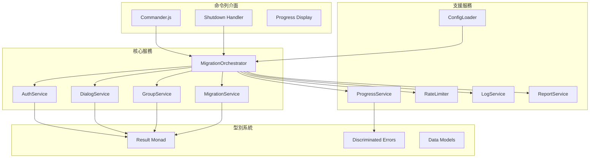
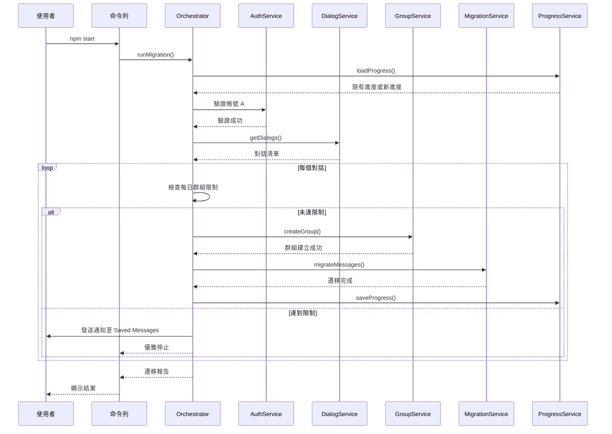

# Telegram Message Migration Tool

使用 GramJS 將 Telegram 帳號 A 的訊息遷移至帳號 B 的命令列工具。

## 功能特色

- 🔄 **完整訊息遷移** - 支援私人聊天、群組、超級群組、頻道訊息的遷移
- 📦 **批次處理** - 可設定批次大小與延遲，避免觸發 Telegram API 限制
- 💾 **斷點續傳** - 自動儲存進度，支援中斷後繼續遷移
- 🛡️ **FloodWait 處理** - 智慧處理 Telegram 速率限制，自動等待後重試
- 📊 **日誌與報告** - 詳細的遷移日誌與統計報告
- 🔧 **彈性設定** - 支援對話類型過濾、日期範圍篩選
- ⚡ **每日群組限制** - 自動追蹤每日群組建立數量（Telegram 限制約 50 個/日）

## 系統需求

- Node.js >= 18.0.0
- Telegram API 憑證（API ID 與 API Hash）

## 快速開始

### 1. 安裝

```bash
# 複製專案
git clone <repository-url>
cd tg-migrate-a-to-b

# 安裝依賴
npm install

# 編譯 TypeScript
npm run build
```

### 2. 設定

複製環境變數範本並填入您的設定：

```bash
cp .env.example .env
```

編輯 `.env` 檔案：

```env
# Telegram API 憑證（從 https://my.telegram.org/apps 取得）
TG_API_ID=your_api_id
TG_API_HASH=your_api_hash

# 來源帳號 A 的電話號碼（含國碼）
TG_PHONE_A=+886912345678

# 目標帳號 B（使用者名稱或電話號碼）
TG_TARGET_USER_B=target_username
```

### 3. 執行遷移

```bash
# 執行遷移
npm start

# 或使用開發模式
npm run dev
```

## 命令列介面

### 主要指令

| 指令 | 說明 |
|------|------|
| `migrate` | 執行訊息遷移（預設指令） |
| `status` | 顯示遷移進度狀態 |
| `export <output>` | 匯出進度至檔案 |
| `import <file>` | 匯入進度檔案 |

### 全域選項

| 選項 | 說明 | 預設值 |
|------|------|--------|
| `-c, --config <path>` | 設定檔路徑 | `./config.json` |
| `-p, --progress <path>` | 進度檔路徑 | `./migration-progress.json` |
| `-v, --verbose` | 啟用詳細輸出（DEBUG 等級） | `false` |
| `-q, --quiet` | 安靜模式（僅 ERROR） | `false` |

### Migrate 選項

| 選項 | 說明 |
|------|------|
| `--dry-run` | 預覽模式，不實際執行遷移 |
| `--dialog <id>` | 僅遷移特定對話 |
| `--from <date>` | 起始日期過濾（ISO 8601 格式） |
| `--to <date>` | 結束日期過濾（ISO 8601 格式） |

### 使用範例

```bash
# 執行遷移
npm start

# 預覽模式
npm start -- --dry-run

# 啟用詳細輸出
npm start -- -v

# 遷移特定對話
npm start -- --dialog 123456789

# 遷移特定日期範圍的訊息
npm start -- --from 2024-01-01 --to 2024-12-31
```

## 環境變數設定

### 必要設定

| 變數 | 說明 |
|------|------|
| `TG_API_ID` | Telegram API ID |
| `TG_API_HASH` | Telegram API Hash |
| `TG_PHONE_A` | 來源帳號 A 的電話號碼 |
| `TG_TARGET_USER_B` | 目標帳號 B（使用者名稱或電話號碼） |

### 遷移設定

| 變數 | 說明 | 預設值 |
|------|------|--------|
| `TG_BATCH_SIZE` | 每批次訊息數量 | `100` |
| `TG_BATCH_DELAY` | 批次間延遲（毫秒） | `1000` |
| `TG_FLOOD_WAIT_THRESHOLD` | FloodWait 自動處理門檻（秒） | `300` |
| `TG_GROUP_CREATION_DELAY` | 建立群組後延遲（毫秒） | `60000` |
| `TG_DAILY_GROUP_LIMIT` | 每日群組建立上限 | `50` |
| `TG_GROUP_PREFIX` | 群組名稱前綴 | `[Migrated]` |

### 檔案路徑

| 變數 | 說明 | 預設值 |
|------|------|--------|
| `TG_SESSION_PATH` | Session 檔案路徑 | `./session-a.txt` |
| `TG_PROGRESS_PATH` | 進度檔案路徑 | `./migration-progress.json` |
| `TG_LOG_FILE` | 日誌檔案路徑 | `./migration.log` |
| `TG_LOG_LEVEL` | 日誌等級 | `info` |

### 對話過濾

| 變數 | 說明 |
|------|------|
| `TG_EXCLUDE_TYPES` | 排除的對話類型（逗號分隔） |
| `TG_INCLUDE_TYPES` | 包含的對話類型（逗號分隔） |
| `TG_EXCLUDE_DIALOGS` | 排除的對話 ID（逗號分隔） |

可用的對話類型：`private`, `group`, `supergroup`, `channel`, `bot`

## 架構概覽



## 遷移流程



## 錯誤處理

本專案使用 **Result Monad** 模式進行型別安全的錯誤處理：

```typescript
// Result 型別定義
type Result<T, E = Error> =
  | { readonly success: true; readonly data: T }
  | { readonly success: false; readonly error: E };

// 使用範例
const result = await authService.authenticate();
if (result.success) {
  console.log('認證成功:', result.data);
} else {
  console.error('認證失敗:', result.error);
}
```

### 錯誤類型

| 類型 | 說明 |
|------|------|
| `AuthError` | 認證相關錯誤 |
| `ConfigError` | 設定相關錯誤 |
| `DialogServiceError` | 對話服務錯誤 |
| `GroupError` | 群組操作錯誤 |
| `MigrationError` | 遷移過程錯誤 |
| `ProgressError` | 進度管理錯誤 |
| `FileError` | 檔案操作錯誤 |
| `RealtimeSyncError` | 即時同步錯誤 |

## 每日群組限制

Telegram 限制每個帳號每日約可建立 50 個群組。本工具會自動追蹤每日建立數量：

- **自動追蹤**：記錄每日已建立的群組數量
- **到達限制時**：自動儲存進度並發送通知至 Saved Messages
- **隔日自動重置**：計數器會在新的一天自動歸零
- **可設定上限**：透過 `TG_DAILY_GROUP_LIMIT` 調整（預設 50）

當達到每日限制時：
1. 工具會自動儲存當前進度
2. 發送通知至您的 Saved Messages
3. 優雅地停止執行
4. 隔天可使用相同指令繼續遷移

## 開發

### 可用指令

```bash
# 開發模式（使用 tsx）
npm run dev

# 編譯 TypeScript
npm run build

# 型別檢查
npm run typecheck

# 程式碼檢查
npm run lint

# 格式化程式碼
npm run format

# 執行測試
npm test

# 測試覆蓋率
npm run test:coverage
```

### 專案結構

```
src/
├── cli/                    # 命令列介面
│   ├── index.ts           # CLI 入口點
│   ├── program.ts         # Commander.js 設定
│   ├── progress-display.ts # 進度顯示
│   └── shutdown-handler.ts # 優雅關閉處理
├── services/               # 核心服務
│   ├── auth-service.ts    # Telegram 認證
│   ├── config-loader.ts   # 設定載入
│   ├── dialog-service.ts  # 對話管理
│   ├── group-service.ts   # 群組操作
│   ├── log-service.ts     # 日誌服務
│   ├── migration-service.ts # 訊息遷移
│   ├── orchestrator.ts    # 遷移協調器
│   ├── progress-service.ts # 進度管理
│   ├── rate-limiter.ts    # 速率限制
│   ├── realtime-sync-service.ts # 即時同步
│   ├── report-service.ts  # 報告生成
│   └── session-manager.ts # Session 管理
├── types/                  # TypeScript 型別
│   ├── enums.ts           # 列舉定義
│   ├── errors.ts          # 錯誤型別
│   ├── interfaces.ts      # 服務介面
│   ├── models.ts          # 資料模型
│   └── result.ts          # Result Monad
└── index.ts               # 主入口點

tests/                      # 測試檔案
├── unit/                  # 單元測試
└── integration/           # 整合測試
```

## 技術棧

- **Runtime**: Node.js >= 18
- **Language**: TypeScript (ES Modules)
- **Telegram API**: [GramJS](https://gram.js.org/)
- **CLI Framework**: [Commander.js](https://github.com/tj/commander.js/)
- **Logging**: [Winston](https://github.com/winstonjs/winston)
- **Testing**: [Vitest](https://vitest.dev/)

## 授權

MIT License

## Mac 可執行檔打包

本工具支援打包為 Mac 原生可執行檔，無需安裝 Node.js 即可執行。

### 建置執行檔

```bash
# 完整建置流程
npm run build:all

# 或分步執行
npm run build          # 編譯 TypeScript
npm run build:bundle   # 打包為單一 JS 檔案
npm run build:sea      # 產生 SEA blob
npm run build:exe      # 產生可執行檔
```

### 執行權限

建置完成後，需要設定執行權限：

```bash
chmod +x dist/tg-migrate
```

### 使用可執行檔

```bash
# 顯示說明
./dist/tg-migrate --help

# 執行遷移
./dist/tg-migrate migrate

# 預覽模式
./dist/tg-migrate migrate --dry-run
```

### 平台支援

- macOS 12 (Monterey) 及更新版本
- Intel (x64) 與 Apple Silicon (arm64) 架構

## 資料清除

使用 `clean` 命令安全刪除所有本機儲存的敏感資料：

```bash
# 互動式確認
npm start -- clean

# 強制刪除（跳過確認）
npm start -- clean --force
```

此命令會刪除：
- Session 檔案（`session.txt`）
- 進度檔案（`migration-progress.json`）
- 日誌檔案（`migration.log`）

## 注意事項

- 請確保您有權限存取來源帳號的所有對話
- 大量遷移可能觸發 Telegram 的速率限制，工具會自動處理
- 建議在穩定的網路環境下執行遷移
- 每日群組建立有上限（約 50 個），超過時工具會自動暫停
- Session 檔案包含敏感認證資訊，請妥善保管
- 本工具使用 Telegram 官方 MTProto 協定，所有通訊皆加密
